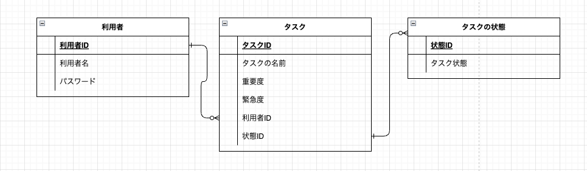

# todo graph - 概念設計

<link rel="stylesheet" href="./css/table-style.css">

## 要件

```markdown
　タスクの優先度を視覚的に一目で判断できる様なtodoアプリが欲しい
```

## エンティティ

```markdown
【ユーザー】：　利用者情報
【タスク】：　追加したタスク情報
【タスクの状態】：　タスクの状態を管理(todo, doing, done)
```

## テーブル間の関係性()

