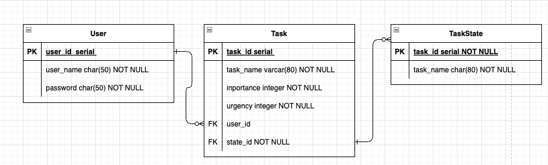

# todo graph - 物理設計

<link rel="stylesheet" href="../css/table-style.css">

## テーブル間の関係性

[ER図編集先](https://drive.google.com/file/d/1hQ-lw2LjRRhoLJzawkr8bvQ-JKn0XO4L/view?usp=sharing)

## 1. ユーザー(ローカル開発用)

<table class="er-style width100">
    <tr>
        <th>カラム名</th>
        <th>データ型</th>
        <th>制約</th>
        <th>説明</th>
    </tr>
    <tr>
        <td>user_id</td>
        <td>serial</td>
        <td>PK</td>
        <td></td>
    </tr>
    <tr>
        <td>user_name</td>
        <td>char(80)</td>
        <td>NOT NULL</td>
        <td></td>
    </tr>
    <tr>
        <td>password</td>
        <td>char(80)</td>
        <td>NOT NULL</td>
        <td>暗号化必須</td>
    </tr>
</table>

## 2. タスク

<table>
    <tr>
        <th>カラム名</th>
        <th>データ型</th>
        <th>制約</th>
        <th>説明</th>
    </tr>
    <tr>
        <td>task_id</td>
        <td>serial</td>
        <td>PK</td>
        <td></td>
    </tr>
    <tr>
        <td>task_name</td>
        <td>char(80)</td>
        <td>NOT NULL</td>
        <td></td>
    </tr>
    <tr>
        <td>importance</td>
        <td>integer</td>
        <td></td>
        <td></td>
    </tr>
    <tr>
        <td>urgency</td>
        <td>integer</td>
        <td></td>
        <td></td>
    </tr>
    <tr>
        <td>user_id</td>
        <td>serial</td>
        <td>FK</td>
        <td></td>
    </tr>
    <tr>
        <td>state_id</td>
        <td>serial</td>
        <td>FK</td>
        <td></td>
    </tr>
    <!-- 追加カラムはここにコピーして編集 -->
</table>

## 3. タスク状態

<table>
    <tr>
        <th>カラム名</th>
        <th>データ型</th>
        <th>制約</th>
        <th>説明</th>
    </tr>
    <tr>
        <td>state_id</td>
        <td>serial</td>
        <td>PK</td>
        <td></td>
    </tr>
    <tr>
        <td>taskState_name</td>
        <td>char(80)</td>
        <td>NOT NULL</td>
        <td></td>
    </tr>
</table>

