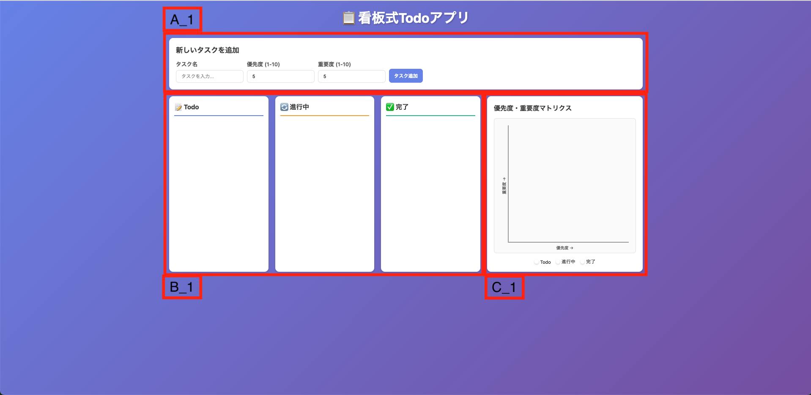
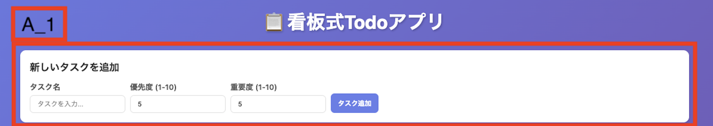
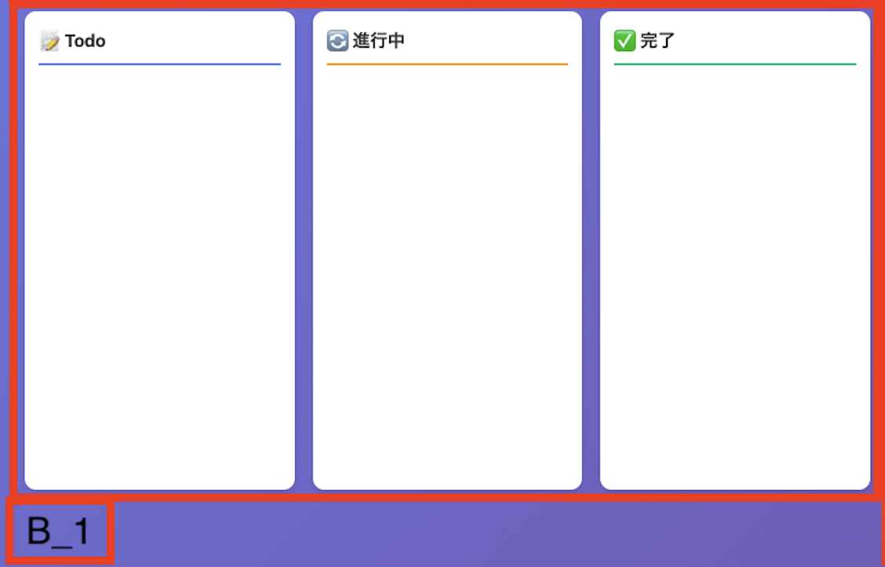
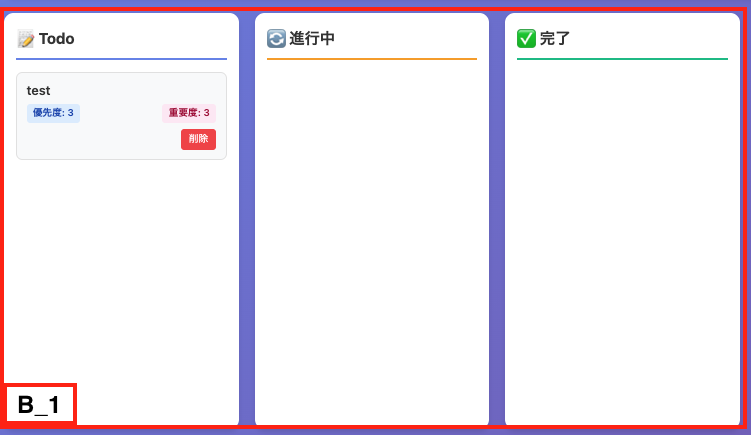
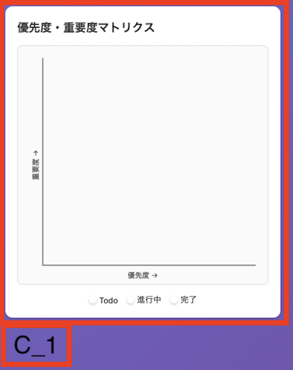

# 画面設計書

## 1. 画面レイアウト

### 1.1 画面イメージ

## 2 画面構成要素

<table>
  <thead>
    <tr>
      <th>項目ID</th>
      <th>コンポーネント</th>
    </tr>
  </thead>
  <tbody>
    <tr>
      <td>A_1</td>
      <td>新規タスクフォーム</td>
    </tr>
    <tr>
      <td>B_1</td>
      <td>カンバン</td>
    </tr>
    <tr>
      <td>C_1</td>
      <td>優先度・緊急度散布図</td>
    </tr>
  </tbody>
</table>

## 2 各画面要素

### A_1

### 2.1.1 画面項目一覧

<table>
  <thead>
    <tr>
      <th>No</th>
      <th>項目名</th>
      <th>項目ID</th>
      <th>項目種別</th>
      <th>必須</th>
      <th>初期値</th>
      <th>最大文字数</th>
      <th>入力制限</th>
      <th>備考</th>
    </tr>
  </thead>
  <tbody>
    <tr>
      <td>1</td>
      <td></td>
      <td></td>
      <td></td>
      <td></td>
      <td></td>
      <td></td>
      <td></td>
      <td></td>
    </tr>
    <tr>
      <td>2</td>
      <td></td>
      <td></td>
      <td></td>
      <td></td>
      <td></td>
      <td></td>
      <td></td>
      <td></td>
    </tr>
    <tr>
      <td>3</td>
      <td></td>
      <td></td>
      <td></td>
      <td></td>
      <td></td>
      <td></td>
      <td></td>
      <td></td>
    </tr>
  </tbody>
</table>

### 2.1.2 ボタン・リンク一覧

<table>
  <thead>
    <tr>
      <th>No</th>
      <th>ボタン/リンク名</th>
      <th>ボタンID</th>
      <th>種別</th>
      <th>表示条件</th>
      <th>処理</th>
      <th>備考</th>
    </tr>
  </thead>
  <tbody>
    <tr>
      <td>1</td>
      <td></td>
      <td></td>
      <td></td>
      <td></td>
      <td></td>
      <td></td>
    </tr>
    <tr>
      <td>2</td>
      <td></td>
      <td></td>
      <td></td>
      <td></td>
      <td></td>
      <td></td>
    </tr>
    <tr>
      <td>3</td>
      <td></td>
      <td></td>
      <td></td>
      <td></td>
      <td></td>
      <td></td>
    </tr>
  </tbody>
</table>

#### 2.1.3 バリデーション

<table>
  <thead>
    <tr>
      <th>No</th>
      <th>項目ID</th>
      <th>バリデーション内容</th>
      <th>エラーメッセージ</th>
      <th>備考</th>
    </tr>
  </thead>
  <tbody>
    <tr>
      <td>1</td>
      <td></td>
      <td></td>
      <td></td>
      <td></td>
    </tr>
    <tr>
      <td>2</td>
      <td></td>
      <td></td>
      <td></td>
      <td></td>
    </tr>
    <tr>
      <td>3</td>
      <td></td>
      <td></td>
      <td></td>
      <td></td>
    </tr>
  </tbody>
</table>

### B_1

#### タスクなし

#### タスクあり

### 2.1.1 画面項目一覧

<table>
  <thead>
    <tr>
      <th>No</th>
      <th>項目名</th>
      <th>項目ID</th>
      <th>項目種別</th>
      <th>必須</th>
      <th>初期値</th>
      <th>最大文字数</th>
      <th>入力制限</th>
      <th>備考</th>
    </tr>
  </thead>
  <tbody>
    <tr>
      <td>1</td>
      <td></td>
      <td></td>
      <td></td>
      <td></td>
      <td></td>
      <td></td>
      <td></td>
      <td></td>
    </tr>
    <tr>
      <td>2</td>
      <td></td>
      <td></td>
      <td></td>
      <td></td>
      <td></td>
      <td></td>
      <td></td>
      <td></td>
    </tr>
    <tr>
      <td>3</td>
      <td></td>
      <td></td>
      <td></td>
      <td></td>
      <td></td>
      <td></td>
      <td></td>
      <td></td>
    </tr>
  </tbody>
</table>

### 2.1.2 ボタン・リンク一覧

<table>
  <thead>
    <tr>
      <th>No</th>
      <th>ボタン/リンク名</th>
      <th>ボタンID</th>
      <th>種別</th>
      <th>表示条件</th>
      <th>遷移先/処理</th>
      <th>備考</th>
    </tr>
  </thead>
  <tbody>
    <tr>
      <td>1</td>
      <td></td>
      <td></td>
      <td></td>
      <td></td>
      <td></td>
      <td></td>
    </tr>
    <tr>
      <td>2</td>
      <td></td>
      <td></td>
      <td></td>
      <td></td>
      <td></td>
      <td></td>
    </tr>
    <tr>
      <td>3</td>
      <td></td>
      <td></td>
      <td></td>
      <td></td>
      <td></td>
      <td></td>
    </tr>
  </tbody>
</table>

#### 2.1.3 バリデーション

<table>
  <thead>
    <tr>
      <th>No</th>
      <th>項目ID</th>
      <th>バリデーション内容</th>
      <th>エラーメッセージ</th>
      <th>備考</th>
    </tr>
  </thead>
  <tbody>
    <tr>
      <td>1</td>
      <td></td>
      <td></td>
      <td></td>
      <td></td>
    </tr>
    <tr>
      <td>2</td>
      <td></td>
      <td></td>
      <td></td>
      <td></td>
    </tr>
    <tr>
      <td>3</td>
      <td></td>
      <td></td>
      <td></td>
      <td></td>
    </tr>
  </tbody>
</table>

### C_1

### 2.1.1 画面項目一覧

<table>
  <thead>
    <tr>
      <th>No</th>
      <th>項目名</th>
      <th>項目ID</th>
      <th>項目種別</th>
      <th>必須</th>
      <th>初期値</th>
      <th>最大文字数</th>
      <th>入力制限</th>
      <th>備考</th>
    </tr>
  </thead>
  <tbody>
    <tr>
      <td>1</td>
      <td></td>
      <td></td>
      <td></td>
      <td></td>
      <td></td>
      <td></td>
      <td></td>
      <td></td>
    </tr>
    <tr>
      <td>2</td>
      <td></td>
      <td></td>
      <td></td>
      <td></td>
      <td></td>
      <td></td>
      <td></td>
      <td></td>
    </tr>
    <tr>
      <td>3</td>
      <td></td>
      <td></td>
      <td></td>
      <td></td>
      <td></td>
      <td></td>
      <td></td>
      <td></td>
    </tr>
  </tbody>
</table>

### 2.1.2 ボタン・リンク一覧

<table>
  <thead>
    <tr>
      <th>No</th>
      <th>ボタン/リンク名</th>
      <th>ボタンID</th>
      <th>種別</th>
      <th>表示条件</th>
      <th>遷移先/処理</th>
      <th>備考</th>
    </tr>
  </thead>
  <tbody>
    <tr>
      <td>1</td>
      <td></td>
      <td></td>
      <td></td>
      <td></td>
      <td></td>
      <td></td>
    </tr>
    <tr>
      <td>2</td>
      <td></td>
      <td></td>
      <td></td>
      <td></td>
      <td></td>
      <td></td>
    </tr>
    <tr>
      <td>3</td>
      <td></td>
      <td></td>
      <td></td>
      <td></td>
      <td></td>
      <td></td>
    </tr>
  </tbody>
</table>
